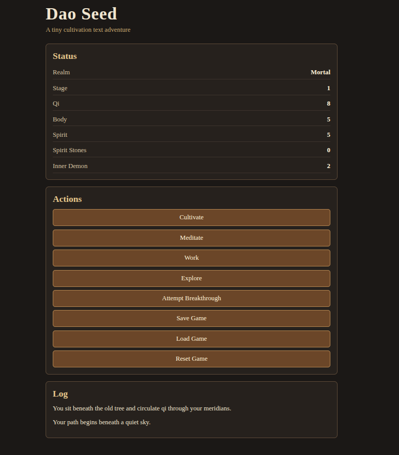

# Dao Seed

Dao Seed is a small browser-based incremental/adventure game built with JavaScript. The project focuses on simple progression systems, save/load logic, modular code organization, and turn-based combat.

## Screenshot

## Live Demo

Play the current prototype here:

https://raoulthef00l.github.io/Dao-Seed/

## Features

- Player progression
- Save and load using localStorage
- Reset/new game logic
- Combat system in development
- Modular JavaScript structure
- On-screen log messages

## What I’m practicing

- JavaScript fundamentals
- Separating systems into modules
- Debugging state issues
- Designing small game loops
- Building a project incrementally instead of over-scoping

## What I Learned

- How to manage game state in plain JavaScript
- How to update the DOM based on player actions
- How to use localStorage for save/load behavior
- How to separate game data, player actions, and UI updates
- How to keep a small project scoped around a playable loop

## Status

Work in progress. The current focus is separating combat logic into its own module and finishing save/load/reset behavior.

## License

License not chosen yet.

